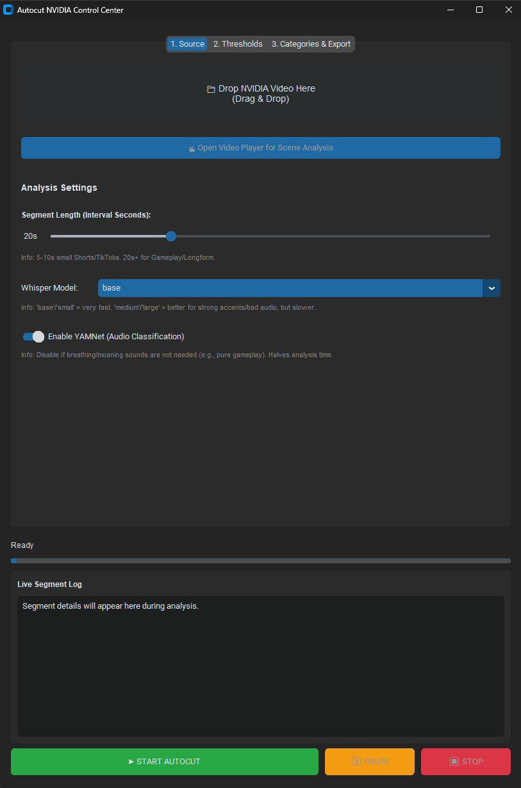
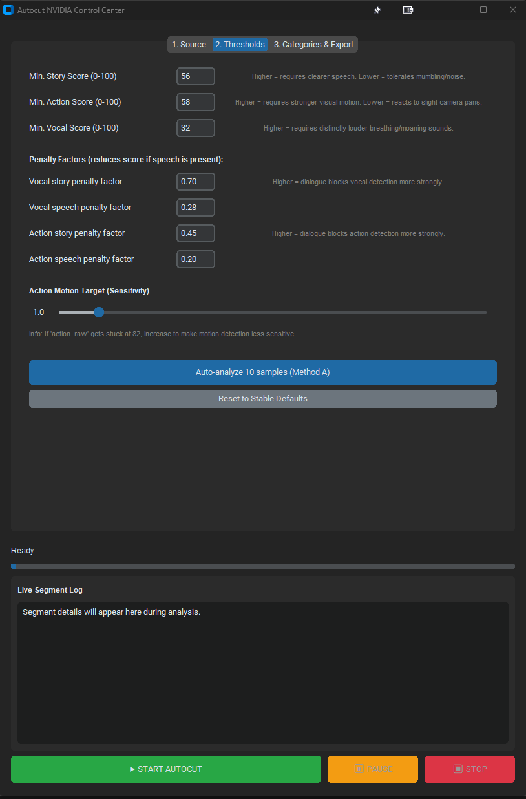
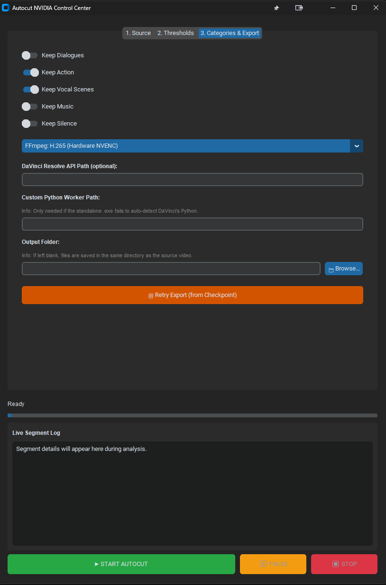

# Scenecut NVIDIA

Desktop tool (CustomTkinter GUI) to analyze video segments and auto-export only selected scene categories (dialogue, action, vocal, etc.).

## Features
- Drag and drop source video in GUI
- Start / Pause / Stop from the source workflow
- Segment analysis with faster-whisper + OpenCV + YAMNet
- Export via FFmpeg (NVENC), or DaVinci Studio XML/EDL/AUTO-RENDER
- Retry export from checkpoint without full re-analysis

## Requirements
- Windows 10/11
- Python 3.10+
- FFmpeg in PATH (`ffmpeg`, `ffprobe`)
- Optional: NVIDIA GPU + CUDA-compatible stack for acceleration
- Optional: DaVinci Resolve for XML/EDL/AUTO-RENDER workflows

## Install
```bash
pip install -r requirements.txt
```

## Run GUI
```bash
python gui_nvidia.py
```


## Windows executable (optional, for GitHub Releases)

### If you use **Conda** (e.g. env `autocut_env`)

1. Open **Anaconda Prompt** (or any shell where `conda` works).
2. `cd` to this folder, then:
   ```bat
   conda activate autocut_env
   pip install -r requirements.txt
   pip install -r requirements-build.txt
   ```
3. Build **without** switching interpreters:
   ```bat
   build_gui_exe_conda.bat
   ```
   That script uses `conda run -n autocut_env` so it always bundles the same env you use for the app. To use another env name, edit `CONDA_ENV=...` at the top of `build_gui_exe_conda.bat`.

If the batch **stopped right after** printing the Python version, you were likely using a `.bat` that called `conda run` **without** `call`. In Windows CMD, the next lines never run. Current `build_gui_exe_conda.bat` uses **`call conda run`** — run it again.

If you still fail at the dependency step, `build_check_deps.py` prints **which** module is missing; install with `pip install -r requirements.txt` inside the env.

### Plain Python (no Conda)

1. Install runtime deps: `pip install -r requirements.txt` (must include **tkinterdnd2**).
2. Install build tools: `pip install -r requirements-build.txt`
3. Run `build_gui_exe.bat` (or `python -m PyInstaller --noconfirm --clean scenecut_gui.spec` from this folder).

Use the **same** `python` / venv for steps 1–3. If PyInstaller uses Python A but `tkinterdnd2` is only installed for Python B, the EXE will crash with `No module named 'tkinterdnd2'`.

The build **must** see **torch**, **onnxruntime**, **faster-whisper**, and **ctranslate2** (same as `requirements.txt`), or **Method A** and **Analyze** in the video player will fail in the EXE with missing modules. The `.spec` bundles them via `collect_all`; the EXE becomes **much larger** and the first build takes longer — that is expected.

### Why is the one-file `.exe` ~1 GB (or more)?

That is **normal** for this stack. A single-file build packs **PyTorch** (often **CUDA** wheels, hundreds of MB), **ONNX Runtime** (especially **GPU** builds), **ctranslate2** (Whisper backend), **OpenCV**, **NumPy**, etc. into one self-contained blob. You are not doing anything wrong.

**Ways to shrink (trade-offs):**

- **CPU-only PyTorch** in the build environment (`pip install torch` CPU index) → much smaller EXE, **no GPU** for torch in the bundled app.
- **Keep GPU** → expect roughly **0.8–1.5+ GB** one-file; hard to avoid without dropping features.
- **One-folder build** (same total bytes, easier to ship as a ZIP; small launcher `ScenecutNVIDIA.exe` + `_internal` folder):  
  `python -m PyInstaller --noconfirm --clean scenecut_gui_onedir.spec`  
  Output: `dist/ScenecutNVIDIA/` — zip the **whole folder** for releases.

Output (one-file): `dist/ScenecutNVIDIA.exe`. Distribute that file; on first run it creates `config_nvidia.ini` and an `output/` folder **next to the exe**.

**Drag & drop:** `tkinterdnd2` is bundled via PyInstaller. On some PCs one-file builds can still misbehave (AV, elevation, Explorer). If drag & drop fails, run `python gui_nvidia.py` from source, or switch the `.spec` to a **one-folder** (`COLLECT`) build — see [PyInstaller docs](https://pyinstaller.org).

**FFmpeg:** still must be installed separately and on `PATH` (the exe does not bundle ffmpeg).

## Config
- `config_nvidia.ini` ships with sensible defaults. `resolve_api_path` is set to Blackmagic’s usual **Windows** folder under `ProgramData` (adjust if your Resolve install differs).
- Set `davinci_python_path` when using the standalone EXE with DaVinci AUTO-RENDER (see Export tab in the GUI).
- Keep machine-specific overrides out of git if you fork the repo; use `config_nvidia.example.ini` as a template.

## Notes
- `yamnet.onnx` and `yamnet_class_map.csv` are included for audio-classification features.
- `output/` is runtime data and excluded from version control.

## Screenshots




## Credit
Thanks OpenAi for the Whisper-Modell
Google/Tensorflow for YAMNet-Model
`yamnet_class_map.csv`from this scource: https://github.com/tensorflow/models/blob/master/research/audioset/yamnet/yamnet_class_map.csv
`yamnet.onnx` form this source https://huggingface.co/zeropointnine/yamnet-onnx/tree/main and special thanks, without the easy access to an onnx file the project wouldn't be possible for me.